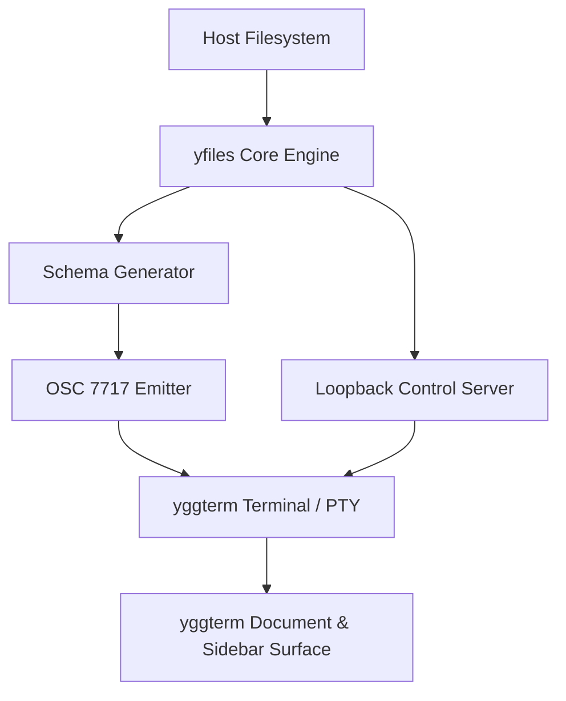

# yfiles Architecture

`yfiles` is structured as a high-speed, headless-friendly visual file manager using the libyggterm Tier A application architecture.

## 1. Structural Layers

1. **Filesystem Engine (`fs_engine`):**
   - High-throughput metadata scanner using asynchronous directory iteration and cached stat queries.
   - Provides sort, filter, mime-type detection, and disk space calculation.

2. **Schema & State Machine (`schema`):**
   - Encodes the current view (path, selection, active view mode, sort order) into libyggterm declarative widgets (`section`, `list-row`, `search-box`, `button`, `footer`).
   - Declares both the **main viewport** (the folder contents) and the **sidebar rail** (Places and Properties).

3. **Transport & Control Endpoint:**
   - Emits `OSC 7717;sidebar;declare` over stdout to register sidebars with yggterm.
   - Serves loopback HTTP endpoints (`/ping`, `/pane/places`, `/pane/properties`, `/action`) for user clicks, keyboard shortcuts, and agent actions.

