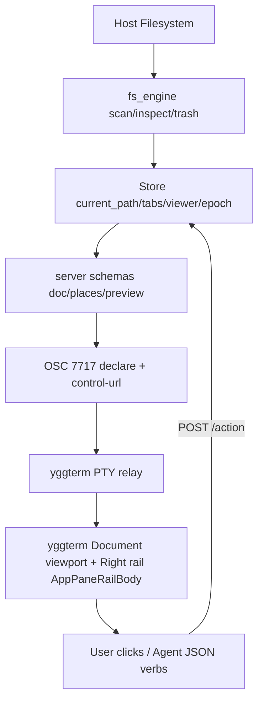

# yfiles Architecture

`yfiles` is a **Tier A libyggterm site** — `yggterm` is the browser, `libyggterm`
is the glue (OSC 7717 + loopback HTTP), `yfiles` declares schemas and the host
paints them. No app-specific chrome lives in `yggterm-shell`.

## 1. Structural Layers

1. **Filesystem Engine (`src/fs_engine.rs`):**
   - Synchronous `read_dir` + cached `stat` + `mime_guess` + `humansize`.
   - `scan_directory(path, show_hidden, sort)` → `Vec<FileEntry>` with dirs-first ordering (name/size/modified/kind).
   - `inspect_path(path)` → `InspectInfo` for the preview pane and headless `inspect` verb.
   - `is_image_path` + `free_space` (via `statvfs`) + `mount_points` (parse `/proc/mounts`) for Places → Devices.
   - ytrace `yfiles/dir-scan` wall span per listing.

2. **Host-Resident Store (`src/state.rs`):**
   - Current path, tabs (open folders), selected entry, `show_hidden`, `SortKind`, `ViewerState` (Picasa carousel: `image_path` + ordered `images` + `index`), `recent` + `epoch`.
   - Persists to `~/.yggterm/yfiles/session.json` (atomic tmp rename). `touch()` bumps `epoch` → `document_version`.
   - Methods: `navigate`, `navigate_up`, `switch_tab`, `close_tab`, `toggle_hidden`, `set_sort`, `new_folder`, `rename`, `trash` (via `trash` crate → `~/.local/share/Trash` or per-filesystem `.Trash-$UID`), `open` (dir→navigate, image→viewer, else select), `viewer_next/prev/close`.

3. **Schemas & Control Endpoint (`src/server.rs`):**
   - Hand-rolled `TcpListener` on `127.0.0.1:0` (yedit/ychrome pattern): `GET /ping` (liveness + `document_version`), `GET /pane/doc` (viewport), `GET /pane/places` (Places + Tabs partitions), `GET /pane/preview` (Preview/metadata card), `POST /action` (every toolbar/row/menu/tabs/search emit).
   - **Viewport `doc`**: browse mode = breadcrumb toolbar + actions toolbar + `search-box` filter + `tabs` sort + `list-row` rows (with `row_action: open_path`, `menu: rename/trash/properties`, `rename` in-place field, `icon` from mime) + footer (count + free space); viewer mode = toolbar (Back/Prev/Next) + `markdown` image (``) + filmstrip `list-row`s + footer.
   - **Sidebar `places`**: `section "Places"` (Home, Root, Documents/Downloads/Pictures/Videos if present) + `section "Devices"` (mounts) + `section "Tabs"` (open folders, `selected`, close action) + `section "Recent"`.
   - **Sidebar `preview`**: `section card:true "Preview"` (image markdown if selected/viewer is image else label) + inspect labels (name/path/type/size/modified/mode) + `section card:true "Actions"` (Rename/Trash).

4. **Transport (`src/osc.rs` + `src/manifest.rs` + `src/main.rs`):**
   - `yfiles --daemon` binds control server, writes `~/.yggterm/yfiles/control-url`, handles `SIGTERM` persist. `yfiles [PATH]` ensures daemon (ping-checked stale-file recovery, `setsid`), `POST /open` with client-cwd-resolved path, then `OSC 7717;sidebar;declare` with `panes: [{id: doc, placement: viewport}, {id: places, placement: rail}, {id: preview, placement: rail}]` + `document_version`. Heartbeat re-emits declare every ~4s (yedit cadence) while foreground blocks.

Tier A only — host paints every widget; `yfiles` never hosts a native surface. Two folders side-by-side = two `yfiles` rows split by `yggterm`; a terminal there = `yggterm`'s own split-terminal, not a widget `yfiles` draws.
